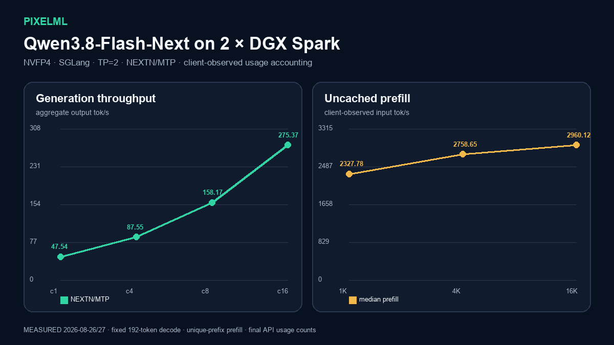

# Qwen3.8-Flash-Next NVFP4 on 2 × DGX Spark

**Measured:** SGLang with NEXTN/MTP, TP=2 across two DGX Spark systems. The verified profile reached **47.54 output tok/s** at concurrency 1, **275.37 aggregate output tok/s** at concurrency 16, and **2,960.12 input tok/s** at a 16K prompt.

## Run it

1. Open [reproduce.ipynb](reproduce.ipynb) on a controller that can SSH to both DGX Spark nodes.
2. Provide the two node aliases, a private local `.env` file based on the detailed recipe's example, and `PIXELML_RUN_LIVE=1`.
3. Run all cells in order. Each node downloads the checkpoint to its own configured local storage; the notebook never assumes shared storage.
4. Edit `PROMPT` and run the final `curl` cell to see the model response and token usage.

The notebook carries the clean measured tables and regenerates the chart from [results/summary.csv](results/summary.csv). The complete lifecycle scripts and compatibility patches are pinned in [PixelML/qwen3-8-flash-next-sglang-2x-dgx-spark](https://github.com/PixelML/qwen3-8-flash-next-sglang-2x-dgx-spark/tree/682504bec9e7e99206212f4e172b7ec823e4605c).
